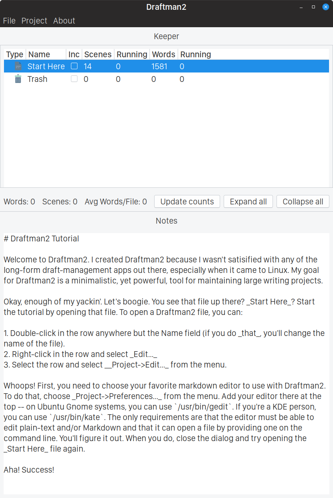

# About Draftman2

Draftman2 is an organizational tool for writers. Although designed with creative writers in mind, Draftman2 is useful for any long-form writing project.

Features:

1. Free and open source
2. Cross platform
3. Minimalist
4. Bring your own editor
5. Markdown/plain-text based

