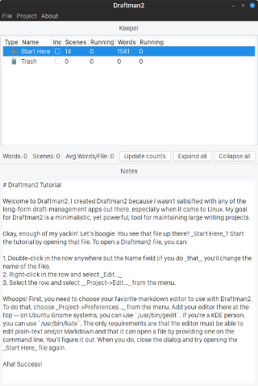

# About Draftman2

Draftman2 is an organizational tool I use for my long-form writing projects.

Features:

1. Free and open source
2. Minimalist
3. Bring-your-own editor
4. Markdown/plain-text based

The Draftman2 App Window

